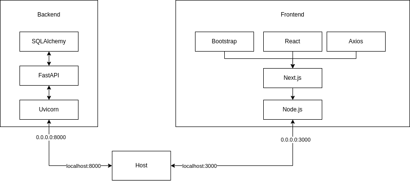

# Analysering av Ljudanalys TDDD96

Kandidatprojekt av grupp PUM08.

Diagrammet finns [här](https://drive.google.com/file/d/1TUQ0p8aGgBi0_mzQ6fKzZpqUxUxs17Jm/view?usp=sharing).

## Quickstart

Detta är en snabbguide för att komma igång. Se [denna readme](./docker) för mer ingående detaljer om Docker.

1. Bygg docker images för frontend/backend `docker compose build`.
2. Starta frontend/backend containers `docker compose up`.
3. Surfa till frontenden på [http://localhost:3000/](http://localhost:3000/)

Du behöver bara bygga om när nya paket ska installeras. Både frontenden och backenden bör auto-uppdatera vid ändringar i källkoden, så förmodligen måste du inte starta om containrarna särskilt ofta. 

## Dev Containers

För att kunna få funktioner för syntax, linting, auto-completion och annat smått och gott utan att behöva installera alla paket på din dator kan du använda [dev containers](https://marketplace.visualstudio.com/items?itemName=ms-vscode-remote.remote-containers). Följ dessa steg för att starta antingen backenden eller frontenden i en dev container.

1. Ladda ner extensionet `Dev Containers` till vscode.
2. Kör kommandot `Dev Containers: Open Folder in Container...` (`Ctrl+P`).
3. Välj antingen mappen som innehåller backenden eller frontenden. Vänta tills dev containern startat ordentligt, du bör se i vänstra hörnet att det står `Dev Container` när den är ansluten.

Extensionet läser ifrån `.devcontainer/devcontainer.json` filen som finns under `backend` och `frontend` mapperna. Den säger åt vscode vilken service den ska använda i `docker-compose.yml` filen, men även vilka extensions den per default ska installera.

